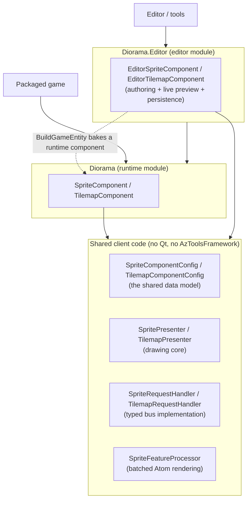
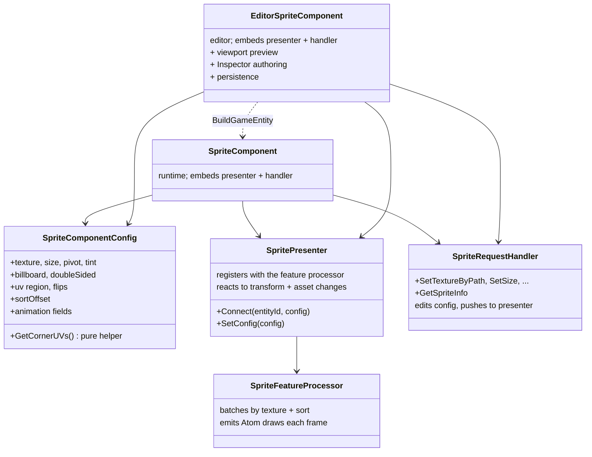
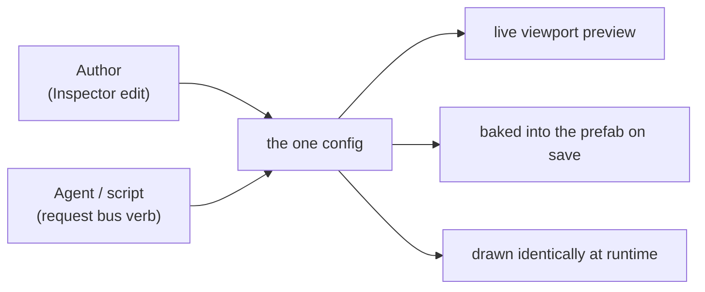
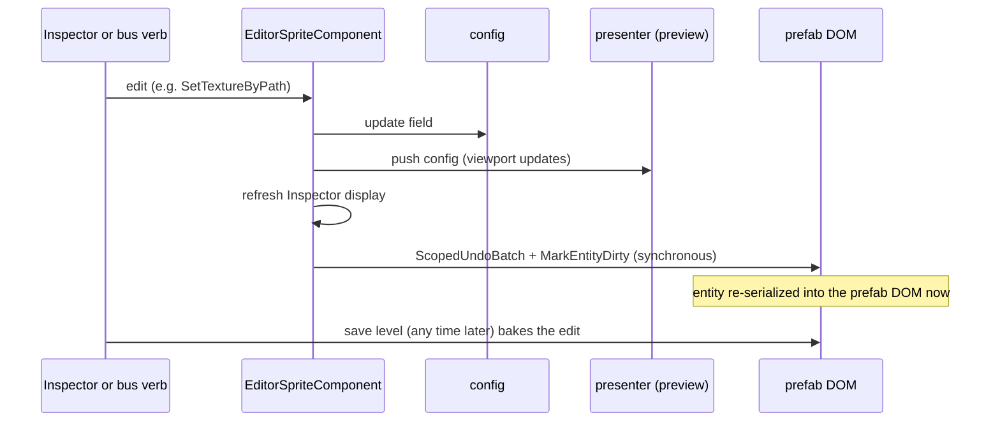
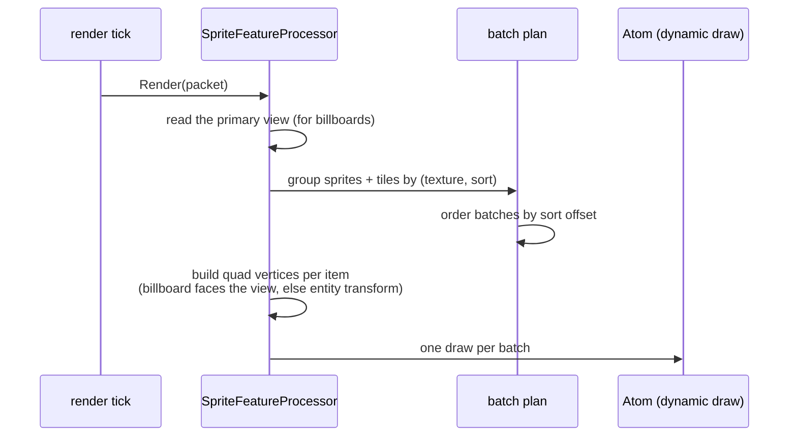

# Architecture

How the Diorama gem is put together: the module split, the data model that ties
the editor and the runtime together, the per-feature object roles, and the
rendering and persistence paths. Read this to understand why the gem is shaped
the way it is before extending it. For the user-facing surfaces see the
[component](reference/sprite-component.md) [references](reference/tilemap-component.md)
and the [API reference](reference/api.md); for guided walkthroughs see the
[how-to guides](howto/README.md).

## Goals that shaped the design

Four priorities drive the structure, in order: security, performance,
efficiency, and ease of use.

- **A shipped game pays only for what it runs.** 2D and 2.5D content should not
  drag the Qt editor framework into a packaged game. This is why the gem is split
  into two modules.
- **Many sprites cost few draw calls.** Sprites and tilemap tiles that share a
  texture collapse into one batched draw, so a busy scene stays cheap.
- **Author once, run identically.** The exact configuration an author sees in
  the editor is the configuration the runtime draws, with no translation step
  that could drift.
- **Both an author and an agent are first-class.** Every parameter is reachable
  from the editor Inspector and from a typed bus, with identical effect and
  identical persistence. Neither path is a second-class citizen.

## The two-module split

Diorama ships as two modules built from one code tree.

- **`Diorama` (runtime client).** Lightweight. Holds the runtime components, the
  shared data model, the presenters, the request-bus handlers, and the feature
  processor. It depends only on Atom and core O3DE systems, never on Qt or
  `AzToolsFramework`. A packaged game enables only this module.
- **`Diorama.Editor` (editor / tools).** Adds the editor components, which embed
  the same shared pieces and add live viewport preview, Inspector authoring, and
  persistence. It carries the Qt and `AzToolsFramework` dependencies. It builds
  on top of the runtime module and is loaded only by the editor and tools.

Because the shared client code lives in the runtime module's private object
library, the editor module reuses it directly. There is no duplicated bus or
drawing logic across the two modules.

## The shared data model

Each feature has one configuration type that both its runtime component and its
editor component hold by value:

- `SpriteComponentConfig` (see the [sprite reference](reference/sprite-component.md))
- `TilemapComponentConfig` (see the [tilemap reference](reference/tilemap-component.md))

The configuration is the single source of truth. The editor authors it, then
hands an identical copy to the runtime component when the scene is exported or
played, through `BuildGameEntity`. Nothing is recomputed or remapped on the way
across, so what you author is exactly what runs.

The config types are pure data plus pure helpers (UV math, frame-grid math, tile
indexing). Those helpers take no asset or application state, so they are
unit-tested on their own, independently of any running editor or renderer. The
`SpriteUVTest`, `SpriteAnimationTest`, and tilemap tests exercise this layer.

## Per-feature object roles

Every feature (Sprite, Tilemap) follows the same four-object shape. Using Sprite
as the example:

- **`SpriteComponentConfig`** is the data (above).
- **`SpritePresenter`** is the drawing core. It owns the live drawable: it
  registers the sprite with the feature processor, reacts to transform changes
  and to the texture asset streaming in, and re-pushes the config when it changes.
  Both the runtime and the editor component embed one, so the sprite draws
  identically in game and in the editor viewport.
- **`SpriteRequestHandler`** implements the typed `DioramaSpriteRequestBus`. Each
  verb edits the config and pushes the result to the presenter. It is forgiving:
  values are validated and clamped, never crashing on bad input. Both components
  embed one, so the bus works in game and in the editor.
- **`SpriteFeatureProcessor`** does the batched rendering into Atom (below). One
  instance per scene draws every registered sprite, and every tilemap tile.

The two components differ only in what they add around this shared core:

| | `SpriteComponent` (runtime) | `EditorSpriteComponent` (editor) |
|---|---|---|
| Embeds presenter + handler | yes | yes |
| Viewport preview while editing | (is the game) | yes |
| Inspector authoring | no | yes (the EditContext) |
| Persists bus edits to the prefab | not needed | yes (marks the entity dirty) |
| In the Add Component menu | no | yes |
| Built by | `BuildGameEntity` | added by an author or agent |

The runtime component is built from the editor component at export time and is
never added directly, so it does not appear in the Add Component menu. Listing it
there would collide with the editor component's identical display name and let a
name lookup resolve the preview-less runtime component by mistake.

## AI and human parity

The request bus and the Inspector are peers over the one configuration. This is
a deliberate invariant, not a coincidence:

Whatever an author can set in the Inspector, an agent can set through the bus,
and vice versa. Both edits change the same config, both update the live preview,
both persist to the saved prefab, and both produce identical runtime output. When
you add a new Diorama editor component that exposes a request bus, it must persist
bus edits the same way, or agent-authored content would bake empty while
Inspector-authored content persisted. That asymmetry is the bug to avoid.

## Persistence: how an edit becomes part of the saved scene

An Inspector edit goes through the property editor, which already marks the
entity dirty so the prefab system records the change. A request-bus edit does
not go through the property editor, so the editor component has to mark the
entity dirty itself, or the new config would be dropped on save (O3DE omits
default-valued fields from a prefab, and an undirtied entity is not re-serialized).

The dirty is done **synchronously**, inside the bus-edit callback, before control
returns to the caller. It cannot be deferred to a later tick to coalesce a burst,
because there is no pre-save hook to flush a pending dirty on (the engine's
`OnSaveLevel` notification fires after the level is already written), so a script
that edits and then immediately saves in the same pass would outrun a deferred
dirty and bake the old config. Marking dirty per edit is cheap (a 256-tile burst
measures well under a tenth of a second), and it matches how painting one tile in
the Inspector records one undo step.

`MarkEntityDirty` only takes effect inside an undo batch, so the work is wrapped
in a `ScopedUndoBatch`, and it is guarded to active entities so prefab
construction and propagation are left untouched.

## Rendering: from config to pixels

Drawing is batched. The presenter keeps each sprite registered with the one
`SpriteFeatureProcessor` for the scene. Each frame the feature processor builds a
batch plan that coalesces everything sharing a texture and a sort layer into a
single draw, orders the batches by sort offset, and emits the Atom draws.

- A **billboarded** sprite's quad is spanned by the primary view's right and up
  axes, so it always faces the camera. A non-billboarded sprite's quad is spanned
  by the entity transform, so it is oriented by the entity (and a tilemap lays its
  grid in the entity local X and Z plane).
- **Sort offset** is a transparent draw-order bias. Larger values draw later, on
  top, which is how 2.5D layering is expressed without moving sprites in depth.
- A **tilemap** does not render itself cell by cell. Each visible tile is fed to
  the same feature processor as a quad sampling its atlas cell, so a whole layer
  sharing one atlas collapses into a single batch.

The gem registers `SpriteFeatureProcessor` with Atom's
`FeatureProcessorFactory`. Because that factory only exists once the Atom RPI
system is up, the Diorama system component declares a dependency on the
`RPISystem` service so it activates after the factory is available. Forgetting
that dependency is what makes a feature-processor gem crash on a null factory at
startup.

## Verifying state without a screenshot

Both buses expose a resolved-state query: `GetSpriteInfo` returns a `SpriteInfo`,
`GetTilemapInfo` returns a `TilemapInfo`. These report what the object is actually
doing (texture or atlas actually streamed in, actually drawable, current animation
frame, number of filled tiles), not merely what was last requested. That lets an
agent confirm an action took effect by reading back state, with no need to capture
and inspect a frame. See the [API reference](reference/api.md) for the fields and a
verify-loop example.

## Component services and dependencies

- A Sprite provides `DioramaSpriteService` and is incompatible with itself, so an
  entity carries at most one. A Tilemap provides `DioramaTilemapService` the same
  way.
- Both require `TransformService`: a sprite or tilemap is positioned by the
  entity transform.
- The Diorama system component requires the `RPISystem` service so it registers
  the feature processor only after Atom is ready.

## Extending the gem

To add a new Diorama visual feature, follow the established shape:

1. A `FooComponentConfig` of pure data plus pure, unit-testable helpers.
2. A `FooPresenter` that owns the drawable and reacts to transform and asset
   changes, embedded by both components.
3. A `FooRequestHandler` implementing a typed, forgiving `DioramaFooRequestBus`,
   embedded by both components, with reflected event names that contain no spaces
   (so they map 1:1 in Lua and Python).
4. A runtime `FooComponent` (no Qt) that builds from the config.
5. An `EditorFooComponent` that adds preview, Inspector authoring, and
   synchronous persistence of bus edits, and appears in the Add Component menu
   while the runtime component does not.

Keep the runtime module free of Qt and `AzToolsFramework`, keep the config as the
single source of truth, and preserve the parity invariant: every bus edit
persists exactly like an Inspector edit.
