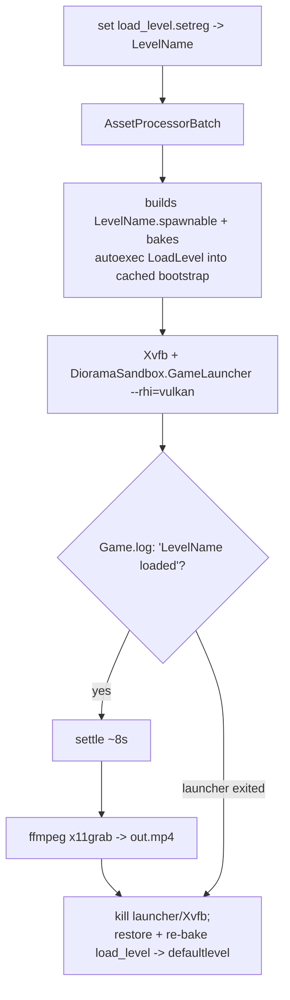

# How-To: Record a Demo Headlessly

Capture a Diorama level to video without a monitor, using the standalone
`GameLauncher` (the editor hangs under Xvfb on this setup; the launcher does not).
This is both a way to produce example clips and a debugging aid: it surfaced the
particle-emitter hang fixed in `Particles2D`. It needs native Vulkan; software
rasterizers (lavapipe) or `--rhi=null` will not render the sprites.

> **Platform:** the capture helper is Linux-specific (Xvfb + `ffmpeg x11grab`). On
> Windows, run the `GameLauncher` normally and record with OBS Studio or
> `ffmpeg`'s `gdigrab`; the in-engine setup is identical (the scene just needs an
> active camera, as the demo levels arrange).

## Quick start

```bash
scripts/capture_level.sh <LevelName> <out.mp4> [seconds]
```

It runs `AssetProcessorBatch` to build the level into the cache, points the
launcher at it, waits for the level to load, settles, records with `ffmpeg`, and
restores the load-level setting afterward. Defaults: `DIORAMA_PROJECT`,
`CAP_DISPLAY=:210`, `CAP_W=1280`, `CAP_H=720` (override via env).

## Two requirements the level must meet

1. **An active render view.** Only the project's startup-level camera auto-activates;
   a freshly authored or copied level renders gray until something calls
   `CameraRequestBus MakeActiveView`. Put `make_active_camera.lua`
   (`Assets/Diorama/Examples`) on the camera entity, or inject a ready-made camera
   with `scripts/prep_demo_camera.py <LevelName> <tx> <ty> <tz> <rx> <ry> <rz>`
   (it copies a known-good Atom Camera and attaches the script). A front view of
   XY-plane content is rotation `-90 0 0` (camera forward `-Z`, up `+Y`).
2. **The level must be in the cache.** There is no live AssetProcessor here, so the
   capture script runs `AssetProcessorBatch` for you. It does **not** delete the
   cached spawnable (doing so with no live AP leaves the level empty -> black).

## The pipeline



## Gotchas (already handled by the script)

- **Order matters: set the level before AssetProcessorBatch.** The launcher merges
  both the live `Registry/load_level.setreg` and a cached
  `bootstrap.<launcher>.<config>.setreg` that AssetProcessorBatch bakes the autoexec
  `LoadLevel` into. If they disagree, the launcher fires two `LoadLevel` commands and
  the cached one wins, loading the wrong level. Setting the value first makes both
  agree.
- **Wiring a Lua script into a prefab by hand:** a `ScriptEditorComponent` needs both
  the inner `ScriptComponent.Script` and a sibling top-level `ScriptAsset` (same
  `{assetId, assetHint}`), or the prefab -> spawnable exporter silently drops it.
- A black frame is ~5 KB; a rendered 1280x720 frame is ~70 KB+. The Atom HUD
  (`FPS`, `VRAM`) confirms a live render; `FPS 0.0` / `VRAM 0.00` means nothing is
  drawing (no active view, empty level, or a stalled game thread).

## Verifying without watching the video

Extract a frame and check it, rather than trusting the run:

```bash
ffmpeg -y -ss 3 -i out.mp4 -frames:v 1 frame.png
```

This complements the no-screenshot state queries (`GetSpriteInfo`) described in
[../architecture.md](../architecture.md#verifying-state-without-a-screenshot): the
queries confirm a component's resolved state, while a capture confirms the scene
actually renders.
