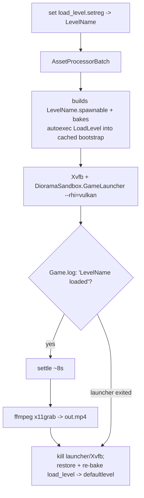

# How-To: Record a Demo Headlessly

Capture a Diorama level to video without a monitor, using the standalone
`GameLauncher` (the editor hangs under Xvfb on this setup; the launcher does not).
This is both a way to produce example clips and a debugging aid: it surfaced the
particle-emitter hang fixed in `Particles2D`. It needs native Vulkan; software
rasterizers (lavapipe) or `--rhi=null` will not render the sprites.

> **Platform:** the Linux helper is `scripts/capture_level.sh` (Xvfb + `ffmpeg
> x11grab`). On Windows use `scripts/capture_level.ps1` (same flow, no Xvfb): see
> [On Windows](#on-windows) below. The in-engine setup is identical on both, the
> scene just needs an active camera, as the demo levels arrange.

## Quick start

```bash
scripts/capture_level.sh <LevelName> <out.mp4> [seconds]
```

It runs `AssetProcessorBatch` to build the level into the cache, points the
launcher at it, waits for the level to load, settles, records with `ffmpeg`, and
restores the load-level setting afterward. Defaults: `DIORAMA_PROJECT`,
`CAP_DISPLAY=:210`, `CAP_W=1280`, `CAP_H=720` (override via env).

## Two requirements the level must meet

1. **An active render view.** Only the project's startup-level camera auto-activates;
   a freshly authored or copied level renders gray until something calls
   `CameraRequestBus MakeActiveView`. Put `make_active_camera.lua`
   (`Assets/Diorama/Examples`) on the camera entity, or inject a ready-made camera
   with `scripts/prep_demo_camera.py <LevelName> <tx> <ty> <tz> <rx> <ry> <rz>`
   (it copies a known-good Atom Camera and attaches the script). A front view of
   XY-plane content is rotation `-90 0 0` (camera forward `-Z`, up `+Y`).
2. **The level must be in the cache.** There is no live AssetProcessor here, so the
   capture script runs `AssetProcessorBatch` for you. It does **not** delete the
   cached spawnable (doing so with no live AP leaves the level empty -> black).

## The pipeline



## Gotchas (already handled by the script)

- **Order matters: set the level before AssetProcessorBatch.** The launcher merges
  both the live `Registry/load_level.setreg` and a cached
  `bootstrap.<launcher>.<config>.setreg` that AssetProcessorBatch bakes the autoexec
  `LoadLevel` into. If they disagree, the launcher fires two `LoadLevel` commands and
  the cached one wins, loading the wrong level. Setting the value first makes both
  agree.
- **Wiring a Lua script into a prefab by hand:** a `ScriptEditorComponent` needs both
  the inner `ScriptComponent.Script` and a sibling top-level `ScriptAsset` (same
  `{assetId, assetHint}`), or the prefab -> spawnable exporter silently drops it.
- A black frame is ~5 KB; a rendered 1280x720 frame is ~70 KB+. The Atom HUD
  (`FPS`, `VRAM`) confirms a live render; `FPS 0.0` / `VRAM 0.00` means nothing is
  drawing (no active view, empty level, or a stalled game thread).

## Verifying without watching the video

Extract a frame and check it, rather than trusting the run:

```bash
ffmpeg -y -ss 3 -i out.mp4 -frames:v 1 frame.png
```

This complements the no-screenshot state queries (`GetSpriteInfo`) described in
[../architecture.md](../architecture.md#verifying-state-without-a-screenshot): the
queries confirm a component's resolved state, while a capture confirms the scene
actually renders.

## On Windows

`scripts/capture_level.ps1` is the Windows counterpart of `capture_level.sh`. It
runs the same flow (set `LoadLevel` -> `AssetProcessorBatch` -> launch the
`GameLauncher` -> wait for the level in `Game.log` -> capture -> restore), with two
platform differences:

- **No Xvfb.** Windows GPU rendering needs a logged-in desktop session with a
  display, so run this *in that session* (the same interactive session a
  self-hosted runner uses), with a monitor (or a dummy/virtual display) attached.
  RHI defaults to **DX12** (no software-rasterizer trap to avoid); override with
  `$env:CAP_RHI = 'vulkan'`.
- **Capture is `ffmpeg gdigrab`** instead of `x11grab`: by default it grabs the
  launcher window by title (`CAP_WINDOW`, default `DioramaSandbox`); set
  `$env:CAP_MODE = 'desktop'` to grab the whole screen if the title does not match.
- **One Asset Processor at a time.** Close the O3DE Editor before capturing: the
  launcher starts its own Asset Processor, and a second one collides over its port.
  The script refuses to run while the Editor is open and clears stray Asset
  Processors first.

```powershell
# video (default 8s)
scripts\capture_level.ps1 -Level MyLevel -Out out.mp4 -Seconds 10

# single PNG frame (deterministic; the seed for an automated "not blank" check)
scripts\capture_level.ps1 -Level MyLevel -Out frame.png -Still
```

Needs `ffmpeg` on `PATH` (`winget install Gyan.FFmpeg`). The level requirements
(an active camera; processed into the cache) are identical to Linux, and the script
handles the cache build for you. The `-Still` mode writes one PNG and is what a CI
visual check would assert against (a black frame is tiny and near-zero variance; a
rendered frame is not), so the same script serves both on-demand demos and a future
automated check.

### Monitor power and unattended runs

Windows GPU rendering needs a display *attached to the session*, so the physical
monitor's power state matters for unattended captures:

- **System sleep is fatal** (the runner and capture stop). Disable it:
  `powercfg /change standby-timeout-ac 0` and `powercfg /change hibernate-timeout-ac 0`.
- **A monitor merely asleep** (power-save / "turn off display after N min") is
  usually fine: Windows keeps the display attached and the compositor keeps
  rendering, so capture still works.
- **A monitor physically powered off or unplugged is risky**, especially over
  DisplayPort, where power-off acts as a hot-unplug: Windows drops the display and
  the scene renders black or fails.

The robust fix for any unattended/headless box is a **dummy display plug** (a cheap
HDMI/DisplayPort headless dongle) or a virtual display driver: it presents a
constant EDID so the GPU always has a stable display regardless of the real
monitor. Recommended if captures run while the monitor is off.
