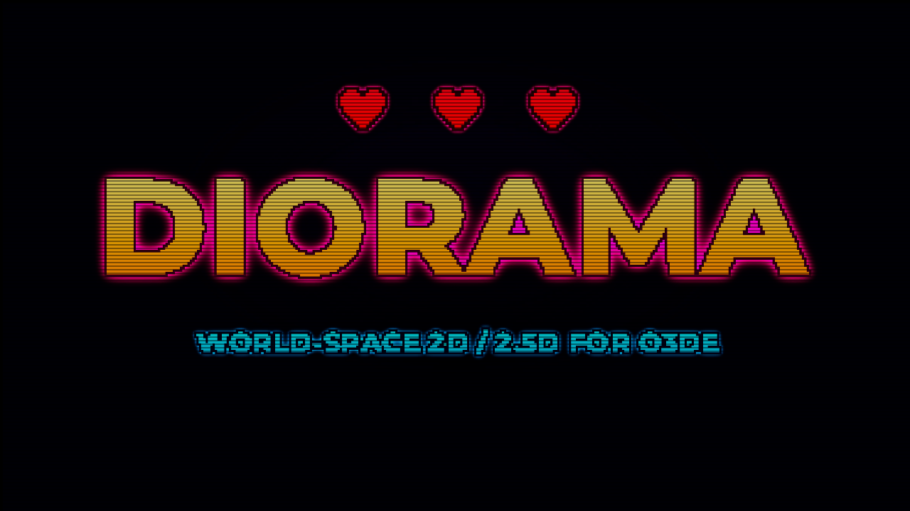

<p align="center">
  
</p>

<p align="center"><em>This logo is rendered in-engine by Diorama: pixel-art sprites composited in world space with the gem's own CRT scanline pass.</em></p>

# Diorama

**World-space 2D and 2.5D for the Open 3D Engine.**

Diorama is an O3DE gem that renders sprites and tilemaps as world objects through
Atom, so flat content lives inside real 3D scenes with lighting, physics, and
depth. It is the world-space counterpart to LyShine's screen-space UI: LyShine
owns the UI layer, Diorama owns world-space 2D content. It ships as a clean,
upstreamable gem, not an engine fork.

> ### Status: alpha (v0.1.0-alpha)
>
> Diorama is in early alpha. The core sprite path works (see the status table
> below), but the API, serialized formats, and component layout may change
> between 0.x releases without a compatibility guarantee. Not yet recommended
> for production. Feedback and issues are welcome.

## Why

O3DE has no first-class path for world-space 2D. LyShine is screen-space UI and
Atom is a 3D PBR renderer, so building a 2D or 2.5D game today means working
against the engine: abusing UI canvases, hand-rolling quads, or bolting sprites
onto 3D meshes. Diorama fills that gap by rendering 2D through Atom, which also
gives 2.5D for free: camera-facing billboards, depth-sorted layers, and sprites
freely mixed with 3D geometry, lighting, particles, and post effects. See
[VISION.md](VISION.md) for the full rationale and design priorities.

- **2D**: flat content composed in the world. Sprites, tilemaps, sprite-sheet
  animation, orthographic and pixel-perfect cameras.
- **2.5D**: those flat elements living inside a 3D scene, with depth sorting,
  parallax, and free mixing with 3D content. This is the sweet spot pure-2D
  engines cannot reach.

## Feature status

| Area | Capability | Status |
| --- | --- | --- |
| Sprite | World-space sprite quad rendered through Atom | Working |
| Sprite | Editor viewport preview via a shared presenter | Working |
| Sprite | Atlas UV sub-regions, horizontal/vertical flip | Working |
| Sprite | Billboard (camera-facing) and fixed orientation | Working |
| Sprite | Sprite-sheet / flipbook animation | Working |
| Rendering | Batched feature processor (texture + sort-layer batching) | Working |
| Rendering | Automatic camera-distance depth sort | Working |
| Rendering | Soft ground shadows under billboards | Working |
| Tilemap | Atlas-grid tilemap component + typed bus | Working |
| 2.5D | Depth-sorted layers + tilted 2.5D camera | Working |
| Scripting | Typed per-feature request buses (Lua, Python, ScriptCanvas) | Working |
| Gameplay | 2D collision: colliders, triggers, and queries reachable from scripts | Working |
| 2.5D | Parallax background layers | Working |
| Camera | 2D camera controller (follow, deadzone, bounds, shake) | Working |
| Camera | Orthographic / pixel-perfect camera | Working |
| Lighting | 2D dynamic lights + normal-mapped sprites | Working |
| Effects | 2D particle emitter | Working |
| Effects | Sprite materials (flash, outline, emissive/bloom) | Working |
| Tilemap | In-editor tile paint tool (editor component mode) | Working |
| Tilemap | Autotiling: 4-bit edge set and 47-tile blob (corner-aware) | Working |
| UI | World/screen HUD: text, bars, panels via a typed bus | Working |
| Post | 2D Look: bloom + vignette over Atom's PostProcess | Working |
| Post | Retro CRT scanline overlay | Working |
| Animation | Skeletal cutout clip player (keyframed bone hierarchy) | Working |
| Animation | Aseprite sprite-sheet import (tags + per-frame timing) | Working |
| Asset pipeline | Native `.aseprite` AssetBuilder (packs atlas + sheet metadata) | Working |
| Audio | One-shot SFX + music via MiniAudio | Working |
| Project | `Diorama2DGame` "New 2.5D Game" project template | Working |
| Tilemap | Dedicated tilemap asset + builder | Planned |

A known alpha limitation: the editor preview does not yet live-update to every
runtime property change. See the roadmap and issues for tracking.

## Requirements

- Open 3D Engine **26.05** (built and verified against the 26.05 SDK).
- The **Atom_RPI** gem (a Diorama dependency, included with O3DE).
- A C++ toolchain and CMake matching your O3DE setup. Linux, Windows, and macOS
  are targeted; active development is on Linux.

## Install

Register the gem with your engine, enable it in a project, then build the
project. Replace the paths with your own.

```bash
# 1. Register the gem with O3DE (one time)
<engine>/scripts/o3de.sh register --gem-path /path/to/o3de-diorama

# 2. Enable it in your project
<engine>/scripts/o3de.sh enable-gem --gem-name Diorama --project-path /path/to/YourProject

# 3. Configure and build the project (profile config shown)
cmake -B /path/to/YourProject/build/linux -S /path/to/YourProject -G "Ninja Multi-Config"
cmake --build /path/to/YourProject/build/linux --config profile
```

On Windows use `o3de.bat` and the appropriate CMake generator.

## Quick start

1. Open your project in the O3DE Editor with the Diorama gem enabled.
2. Create an entity and add the **Sprite** component.
3. Assign a texture to `Config | Texture`.
4. Optionally set an atlas sub-region under `Config | Atlas / UV Region`
   (`UV Min` / `UV Max`, plus `Flip Horizontal` / `Flip Vertical`), a world
   `Size`, `Billboard`, and a 2.5D `Layering | Sort Offset`.

The sprite renders in world space and is visible both in the editor viewport and
at runtime.

### Start a whole project from the template

To scaffold a fresh 2.5D project with the gem already enabled, register the
bundled project template once and create a project from it:

```bash
<engine>/scripts/o3de.sh register --template-path /path/to/o3de-diorama/Templates/Diorama2DGame
<engine>/scripts/o3de.sh create-project --project-path /path/to/MyGame --template-name Diorama2DGame
```

The new project ships with Diorama enabled, 2.5D starter assets, and a
`STARTING.md` first-steps guide. See
[How-To: Start a New 2.5D Game from the Template](Docs/howto/20-template.md).

## Architecture

- **Two-module split.** A lightweight runtime client module and a separate Qt
  editor module. Shipped games carry only the runtime, with no Qt or
  AzToolsFramework dependency, so adding 2D costs little at runtime while authors
  still get full editor tooling.
- **Integration over reinvention.** Diorama builds on existing O3DE systems
  (transforms, prefabs, scripting, physics) instead of inventing parallel ones.
- **A path designed to scale.** Rendering goes through a batched Atom feature
  processor: sprites and tilemap tiles that share a texture collapse into one
  draw call, so a busy scene stays cheap.

For the full design with diagrams (module split, data model, persistence, and
the render path) see [Docs/architecture.md](Docs/architecture.md). In-depth
references live under [Docs/reference/](Docs/reference/): every
[Sprite](Docs/reference/sprite-component.md) and
[Tilemap](Docs/reference/tilemap-component.md) parameter, and the typed
[bus API](Docs/reference/api.md) for scripts and agents.

## Roadmap

The documentation and sample ladder (full outline in
[Docs/examples-outline.md](Docs/examples-outline.md)) builds from one sprite up:

1. Hello Sprite (done)
2. Animated Sprite, sprite-sheet playback (done)
3. Sprite Atlas, batched shared atlas (done)
4. Tilemap, atlas-grid component (done)
5. Parallax and Layers, 2.5D layering + scroll script (done)

An early twin-stick shooter sample exists but is not yet polished, so it is
parked under [`Samples/TwinStick`](Samples/TwinStick) rather than shipped as a
gem asset. A polished flagship showcase (see below) is the intended capstone.

Bonus tracks: custom sprite material/shader and a
thousands-of-sprites stress scene.

**What's next**

- Consume the `.aseprite` sheet metadata at runtime (asset-reference mode on the
  sprite component, beyond the current JSON import).
- A scene-to-image export API (render a Diorama scene to a PNG at any resolution),
  which doubles as a deterministic headless capture path.
- A flagship "Living Diorama" showcase: a layered miniature scene with real
  front-to-back depth.
- Toward a `0.2.0-beta`: settle the bus API surface, a verified Windows host
  build, and an always-available build/test CI gate.

## Versioning

Diorama follows [Semantic Versioning](https://semver.org/). During alpha the
version stays on the **0.x** line, where minor (`0.MINOR.0`) bumps may include
breaking changes and patch (`0.x.PATCH`) bumps are fixes. Each release is an
annotated git tag (`vMAJOR.MINOR.PATCH`) and is recorded in
[CHANGELOG.md](CHANGELOG.md). The `version` field in
[gem.json](gem.json) tracks the current release. A stable API is the goal of the
eventual 1.0.

## Contributing

Diorama complements the engine and contributes fixes back upstream. If something
in O3DE (Atom, AzCore, asset builders, and so on) is found broken or improvable
while working on Diorama, it is flagged and contributed back to
[o3de/o3de](https://github.com/o3de/o3de) rather than patched around.

Guidelines:

- Keep the runtime client module free of Qt and AzToolsFramework. Editor-only
  code lives in the editor module.
- Treat asset-sourced data as untrusted: validate and bound it in builders and at
  load. No unchecked sizes feed GPU buffers.
- No per-frame allocations in the render loop.
- Match the surrounding code style and the existing SPDX file headers.

## Continuous integration

Two workflows run in CI:

- **lint** (always on, GitHub-hosted): clang-format (pinned), SPDX headers,
  whitespace/EOF hygiene, and JSON manifest validation. This is the gate every
  push and pull request must pass. Format C++ with clang-format **18.1.8** to
  match it (a newer local version may format differently).
- **build-test** (on-demand, self-hosted): compiles the gem through a host O3DE
  project and runs the unit tests. Building needs the full O3DE SDK, which does
  not fit on a hosted runner, so there is no always-on build runner. In practice
  the build and test gate is run **on demand** before merging a code change, by
  running `scripts/ci_build_test.sh` locally (it does the same configure, build,
  and `AzTestRunner` steps as the workflow). The `build-test` workflow stays
  available for a runner brought online on demand: trigger it manually or add the
  `ci:build` label to a pull request. See
  [Docs/ci-self-hosted-runner.md](Docs/ci-self-hosted-runner.md).

## License

Licensed under either of

  * **Apache License, Version 2.0** ([LICENSE-APACHE](LICENSE-APACHE)), or
  * **MIT license** ([LICENSE-MIT](LICENSE-MIT))

at your option. Every source file carries `SPDX-License-Identifier: Apache-2.0 OR MIT`
declaring the same dual license.

Unless you explicitly state otherwise, any contribution intentionally submitted for
inclusion in this project by you, as defined in the Apache-2.0 license, shall be dual
licensed as above, without any additional terms or conditions.
